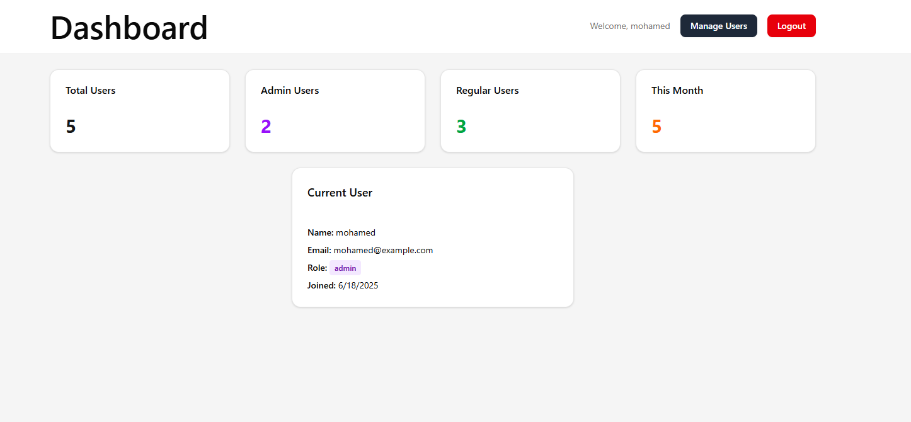
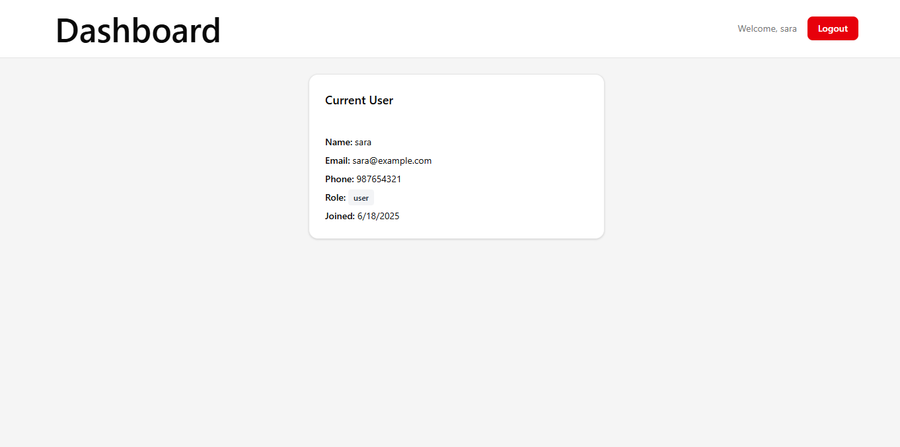
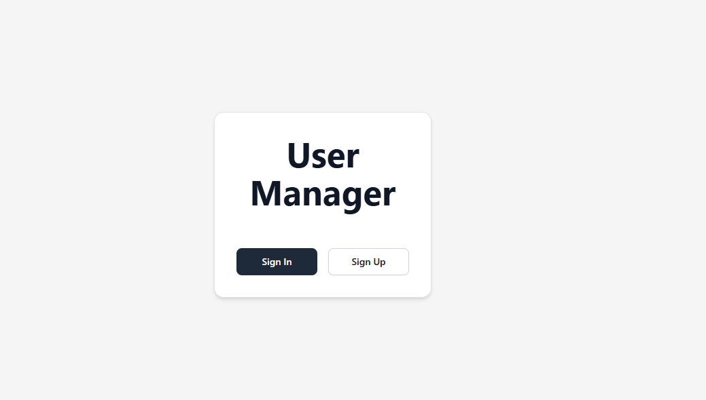
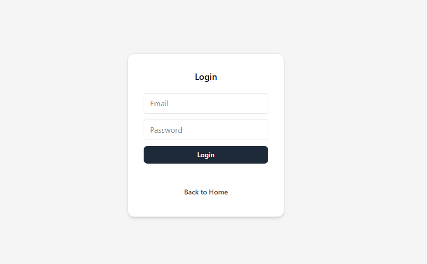
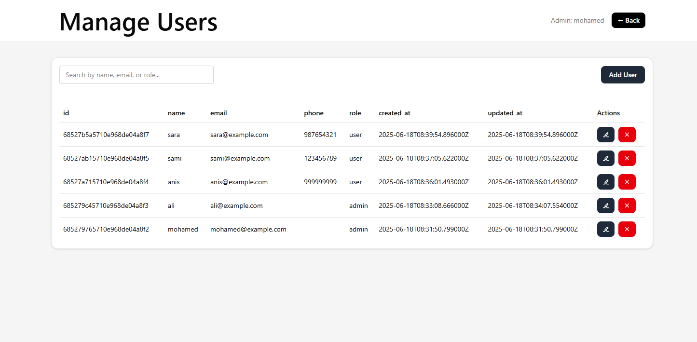
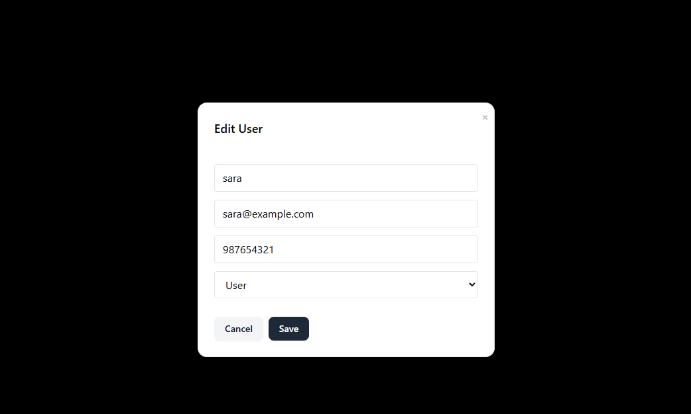
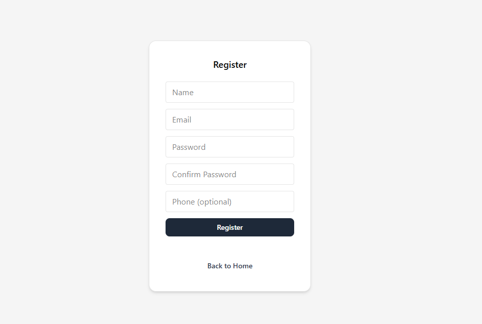

# User Manager – Technical Test

## 📄 Description
A full-stack web application for user management, built as part of a technical test. The stack includes:

- **Backend:** Laravel 12 (API mode) with MongoDB Atlas  
- **Frontend:** React with ShadCN UI  
- **Styling:** ShadCN UI components and Tailwind CSS utility classes  
- **Authentication:** Custom token system (see explanation below)

---

## 🚀 Quick Start

### 1. Clone the Repository
```bash
git clone https://github.com/MezghaniDali/usermanager.git
cd usermanager
```

### 2. Backend Setup (Laravel API)
```bash
cd backend
```

**Copy environment file**

On **Windows PowerShell**:
```powershell
Copy-Item .env.example .env
```

On **Mac/Linux**:
```bash
cp .env.example .env
```

- Open `.env` and set your MongoDB Atlas URI and credentials(see below for details).

**Install dependencies and run server**
```bash
composer install
php artisan key:generate
php artisan migrate   # if needed
php artisan serve
```

- The backend will run at: http://localhost:8000

### 3. Frontend Setup (React)
```bash
cd ../frontend
npm install
npm run dev
```

- The frontend will run at: http://localhost:5173

> 💡 Make sure both servers stay running (each in a separate terminal) for the app to function properly.

---

## ⚙️ MongoDB Atlas Configuration

- Create a free cluster on [MongoDB Atlas](https://www.mongodb.com/cloud/atlas)
- Whitelist your IP address in the Atlas dashboard 
- Copy your connection string and update the `DB_URI` in your `.env` file:

```env
DB_URI="mongodb+srv://<username>:<password>@<cluster-url>/<dbname>?retryWrites=true&w=majority"
DB_DATABASE=usermanager
```

---

## ✅ Features

- **User Authentication:**
  - Registration and login with secure password hashing
  - API authentication using a custom token system
  - Middleware-protected routes

- **User Management:**
  - List, create, update, and delete users
  - Responsive user table (ShadCN UI)
  - All actions connect to the Laravel API and MongoDB Atlas

- **Security:**
  - Passwords hashed using bcrypt
  - Admin-only routes secured with middleware
  - Input validation

---

## 👤 User Roles & Access

- **First registered user** is automatically given admin privileges
- **Admins** can:
  - Manage users (CRUD)
  - Access advanced stats on the dashboard
- **Regular users**:
  - Can view their own profile
  - Have no access to admin or user management features

---

## ❓ Why not Sanctum?

> I initially implemented Laravel Sanctum as recommended. However, integration issues arose with MongoDB (via jenssegers/laravel-mongodb), since Sanctum is optimized for Eloquent (SQL). Workarounds were too unstable and time-consuming.  
> Therefore, I implemented a custom token system with secure middleware and validation.  
> In a real-world SQL-based Laravel project, I would use Sanctum or Passport.

---

## 🔐 Security Notes

- Protected routes require authentication and admin access
- Passwords are always hashed
- User input is validated

---

## 🖼️ Screenshots

- 
- 
- 
- 
- 
- 
- 

---

## ⚙️ Technical Choices & Trade-offs

- **Sanctum:** Attempted but replaced due to MongoDB integration issues. Custom token system used for demo purposes.
- **jenssegers/laravel-mongodb:** Used for MongoDB Eloquent integration
- **ShadCN UI:** For modern, accessible React component styling

---

## 📜 License
MIT
